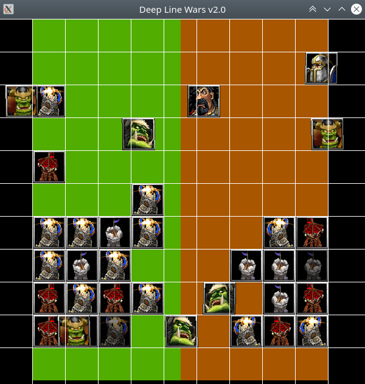

# Deep Line Wars v2.0
This version of the Deep Line Wars is a C++ port, and improvement of the v1.0 version of [DLW](https://github.com/cair/deep-line-wars). This version significantly boosts the execution performance, and gets rid of several bugs.

# Requirements
While not absolute minimum, the library was developed using following dependencies
* Python 3.8.2
* C++17 compatible C++ compiler

# Installation
```bash
pip install git+https://github.com/cair/deep-line-wars-2
```

# Showcase


# Licence
MIT License

Copyright (c) 2020 Per-Arne Andersen

Permission is hereby granted, free of charge, to any person obtaining a copy of this software and associated documentation files (the "Software"), to deal in the Software without restriction, including without limitation the rights to use, copy, modify, merge, publish, distribute, sublicense, and/or sell copies of the Software, and to permit persons to whom the Software is furnished to do so, subject to the following conditions:

The above copyright notice and this permission notice shall be included in all copies or substantial portions of the Software.

THE SOFTWARE IS PROVIDED "AS IS", WITHOUT WARRANTY OF ANY KIND, EXPRESS OR IMPLIED, INCLUDING BUT NOT LIMITED TO THE WARRANTIES OF MERCHANTABILITY, FITNESS FOR A PARTICULAR PURPOSE AND NONINFRINGEMENT. IN NO EVENT SHALL THE AUTHORS OR COPYRIGHT HOLDERS BE LIABLE FOR ANY CLAIM, DAMAGES OR OTHER LIABILITY, WHETHER IN AN ACTION OF CONTRACT, TORT OR OTHERWISE, ARISING FROM, OUT OF OR IN CONNECTION WITH THE SOFTWARE OR THE USE OR OTHER DEALINGS IN THE SOFTWARE.
